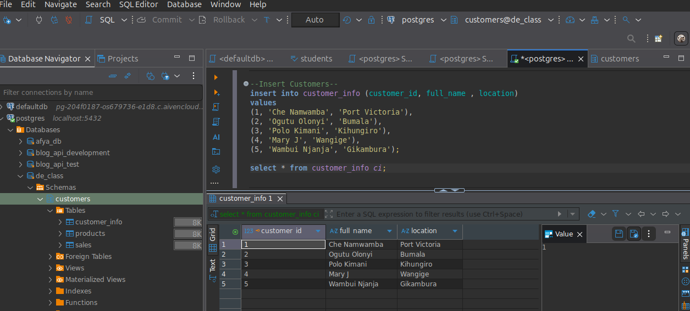

# Customer Purchases & Sales Analytics Database

### Goal:
Create a small database to track customers, products, and sales.  
Then, run queries to answer common business questions such as:
- Who bought what?
- How much did each customer spend?
- Which product generated the highest total sales?
- Who hasn’t purchased anything yet?

---
## Create database
```sql
CREATE DATABASE de_class;

## Create a schema
CREATE SCHEMA customers;

## Create Tables
We will create three tables:

- customer_info → Stores customer details.

- products → Stores product catalog details.

- sales → Records individual purchases.


## Insert Sample Data
- Insert customer records


- Insert product records


Insert sales record


## Run Queries and View Results

1. Who bought what?


2. How much did each customer spend?


3. Which products generate the most revenue?


4. Who hasn’t purchased anything yet?


Entities:

- customer_info → Stores customer details.

- products → Stores product catalog details.

- sales → Records individual purchases.