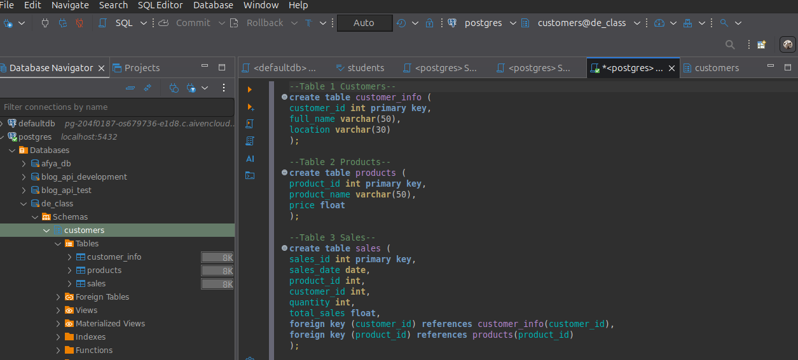
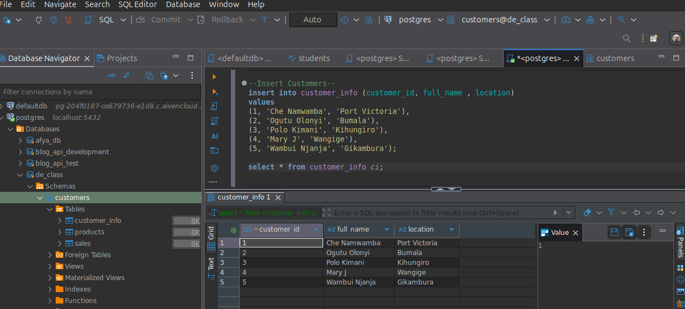
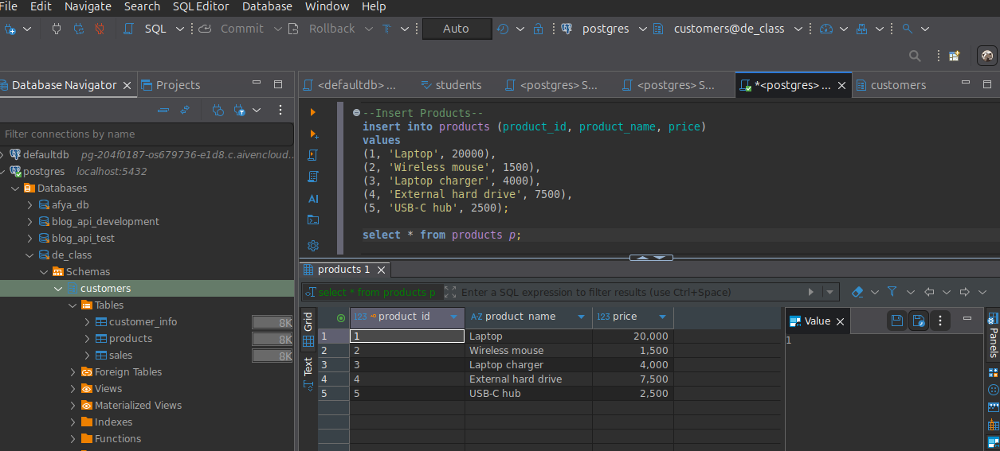
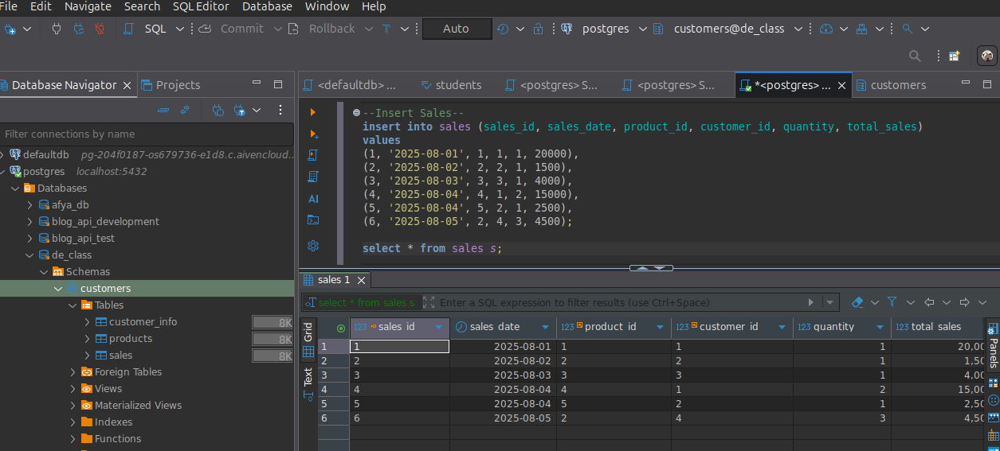
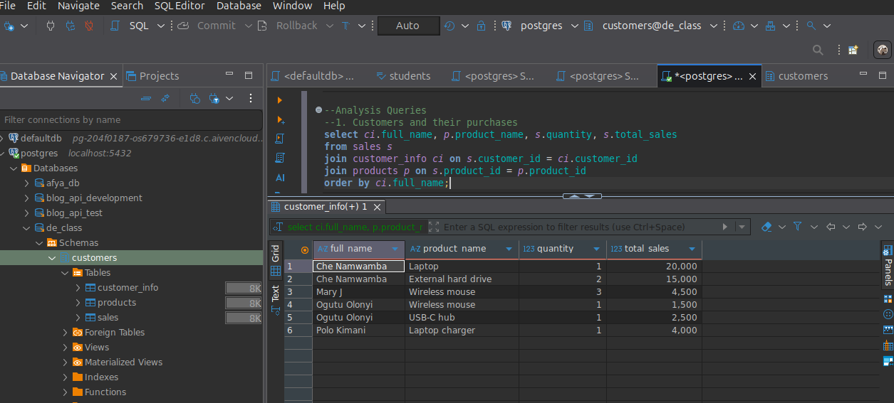
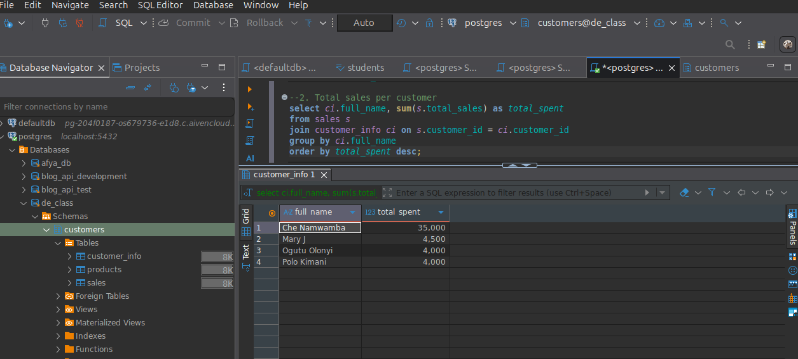
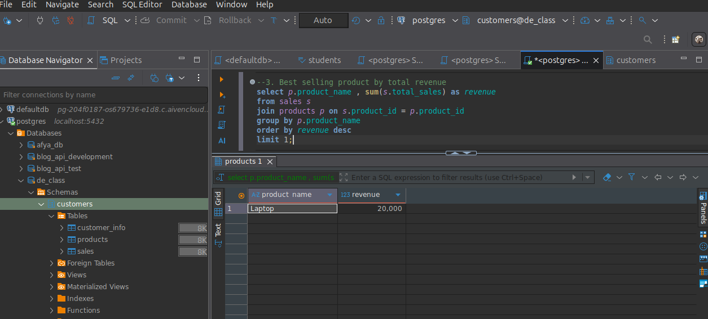
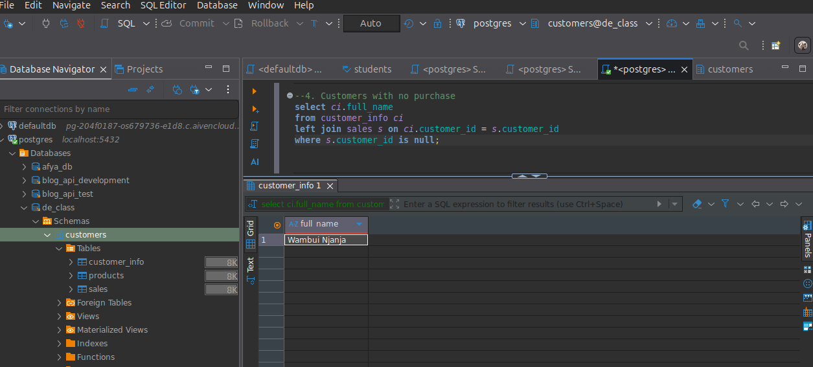

# Customer Purchases & Sales Analytics Database

### Goal: Create a small database to track customers, products, and sales.

Then, run queries to answer common business questions such as:
- Who bought what?
- How much did each customer spend?
- Which product generated the highest total sales?
- Who hasn't purchased anything yet?

---

## Create database
```sql
CREATE DATABASE de_class;
```

## Create a schema
```sql
CREATE SCHEMA customers;
```

## Create Tables
We will create three tables:

- customer_info → Stores customer details.
- products → Stores product catalog details.
- sales → Records individual purchases.

<p align="center">

</p>

## Insert Sample Data

- Insert customer records

<p align="center">

</p>

- Insert product records

<p align="center">

</p>

- Insert sales record

<p align="center">

</p>

## Run Queries and View Results

1. Who bought what?

<p align="center">

</p>

2. How much did each customer spend?

<p align="center">

</p>

3. Which products generate the most revenue?

<p align="center">

</p>

4. Who hasn't purchased anything yet?

<p align="center">

</p>

## Entities:

- customer_info → Stores customer details.
- products → Stores product catalog details.
- sales → Records individual purchases.