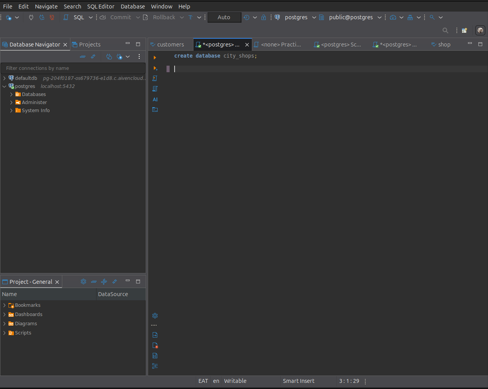
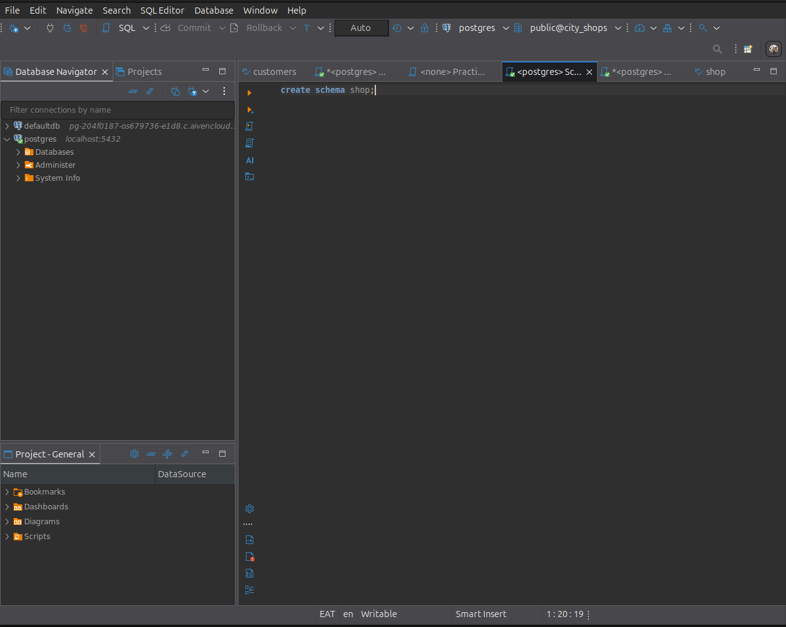
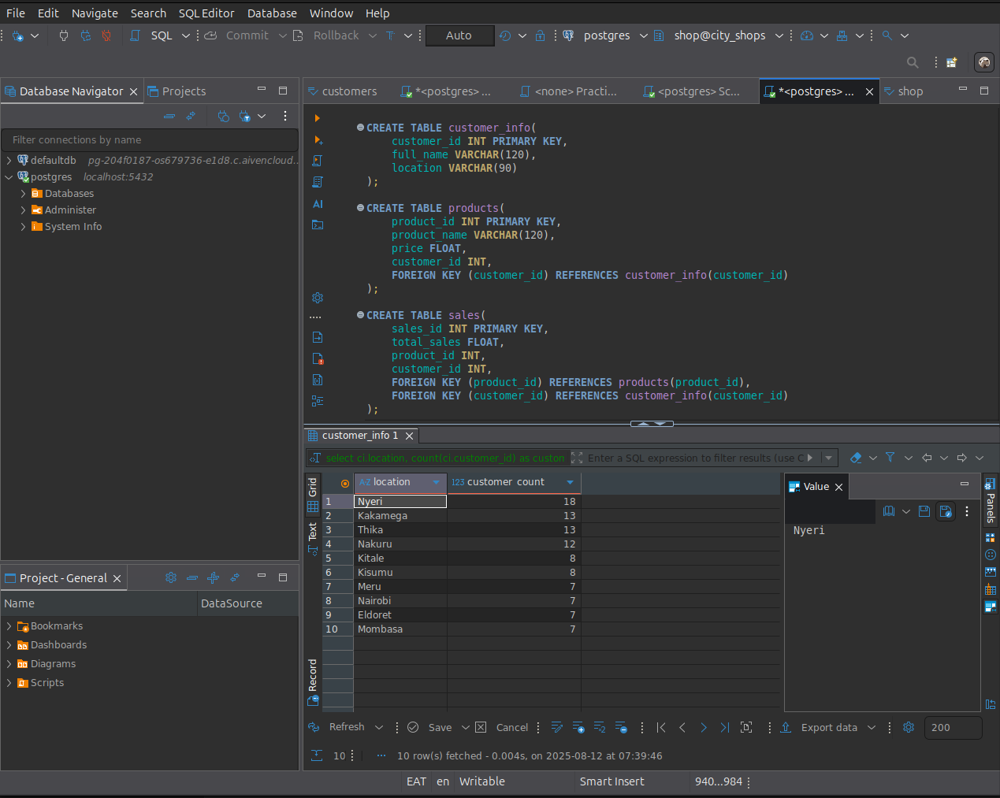

# City Shops Database Documentation

## Database Setup

### Creating the Database and Schema
```sql
-- This script creates a new database named 'city_shops'
CREATE DATABASE city_shops;

-- This script creates a new schema named 'shop'
CREATE SCHEMA shop;
```

<p align="center">

</p>

<p align="center">

</p>


## Table Structure

### Creating Tables

```sql
CREATE TABLE customer_info(
    customer_id INT PRIMARY KEY,
    full_name VARCHAR(120),
    location VARCHAR(90)
);

CREATE TABLE products(
    product_id INT PRIMARY KEY,
    product_name VARCHAR(120),
    price FLOAT,
    customer_id INT,
    FOREIGN KEY (customer_id) REFERENCES customer_info(customer_id)
);

CREATE TABLE sales(
    sales_id INT PRIMARY KEY,
    total_sales FLOAT,
    product_id INT,
    customer_id INT,
    FOREIGN KEY (product_id) REFERENCES products(product_id),
    FOREIGN KEY (customer_id) REFERENCES customer_info(customer_id)
);
```

<p align="center">

</p>


### Data Insertion

```sql
-- Insert data into customer_info table
INSERT INTO customer_info (customer_id, full_name, location) VALUES
-- (Add your customer data here)

-- Insert data into products table  
INSERT INTO products (product_id, product_name, price, customer_id) VALUES
-- (Add your product data here)

-- Insert data into sales table
INSERT INTO sales (sales_id, total_sales, product_id, customer_id) VALUES
-- (Add your sales data here)
```

## SQL Practice Queries

### Section 1: Basic Queries with Sorting and Limiting

#### 1. Retrieve all customers sorted alphabetically
```sql
SELECT * FROM customer_info 
ORDER BY full_name;
```

#### 2. Get top 5 most expensive products
```sql
SELECT product_id, product_name, price 
FROM products 
ORDER BY price DESC
LIMIT 5;
```

#### 3. Display products from row 6 to 10 (pagination)
```sql
SELECT product_id, product_name, price 
FROM products 
ORDER BY price DESC 
LIMIT 5 OFFSET 5;
```

### Section 2: WHERE Clauses with CASE Statements

#### 4. Count customers in Kisumu
```sql
SELECT COUNT(*) as total_customers 
FROM customer_info 
WHERE location = 'Kisumu'
GROUP BY location;
```

#### 5. Products with price categories (100-500 range)
```sql
SELECT product_id, product_name, price,
CASE
    WHEN price < 300 THEN 'Low'
    WHEN price BETWEEN 300 AND 1000 THEN 'Medium'
    ELSE 'High'
END as price_category
FROM products 
WHERE price BETWEEN 100 AND 500
ORDER BY price DESC;
```

#### 6. Sales categorization
```sql
SELECT sales_id, customer_id, total_sales,
CASE
    WHEN total_sales > 1000 THEN 'Big Sale'
    ELSE 'Small Sale'
END as sale_size
FROM sales 
WHERE total_sales > 1000;
```

### Section 3: JOIN Operations with Sorting

#### 7. Sales with product and customer details
```sql
SELECT sales_id, product_name, full_name 
FROM sales s
JOIN products p ON s.product_id = p.product_id 
JOIN customer_info ci ON s.customer_id = ci.customer_id 
ORDER BY s.total_sales DESC;
```

#### 8. Products with customer locations
```sql
SELECT product_name, location 
FROM products p 
JOIN customer_info ci ON p.customer_id = ci.customer_id 
ORDER BY location, p.product_name;
```

#### 9. Sales with complete product information
```sql
SELECT full_name, product_name, price 
FROM products p 
JOIN customer_info ci ON p.customer_id = ci.customer_id 
ORDER BY p.price DESC;
```

### Section 4: GROUP BY with HAVING Clauses

#### 10. Customers with multiple products
```sql
SELECT ci.full_name,
COUNT(p.product_id) as product_count
FROM customer_info ci 
JOIN products p ON ci.customer_id = p.customer_id 
GROUP BY ci.full_name 
HAVING COUNT(p.product_id) > 2;
```

#### 11. High-performing products by sales
```sql
SELECT p.product_name, SUM(s.total_sales) as total_sales
FROM sales s
JOIN products p ON s.product_id = p.product_id
GROUP BY p.product_name 
HAVING SUM(s.total_sales) > 2000;
```

#### 12. Customer distribution by location
```sql
SELECT ci.location, COUNT(ci.customer_id) as customer_count
FROM customer_info ci 
GROUP BY ci.location 
ORDER BY customer_count DESC;
```

## Key Learning Points

### Database Design
- **Primary Keys**: Unique identifiers for each table
- **Foreign Keys**: Relationships between tables
- **Data Types**: Appropriate selection for different data

### Query Techniques
- **ORDER BY**: Sorting results
- **LIMIT/OFFSET**: Pagination
- **CASE Statements**: Conditional logic in queries
- **JOIN Operations**: Combining data from multiple tables
- **GROUP BY/HAVING**: Aggregation and filtering of grouped data

### Best Practices
- Use meaningful table and column names
- Establish proper relationships with foreign keys
- Index frequently queried columns
- Use appropriate data types for storage efficiency
- Write readable, well-formatted SQL queries

## Database Schema Summary

The database consists of three main entities:
- **Customers**: Personal information and location
- **Products**: Product details with ownership
- **Sales**: Transaction records linking customers and products

This structure supports comprehensive sales analysis and customer relationship management.